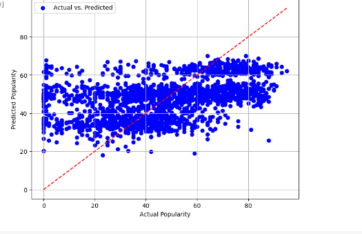

# CSE 151A Project
Group Members: Christen Xie, Ojas Vashishtha, Liam Manatt, Akshat Jain

## Colab Notebook:
View only link [here](https://colab.research.google.com/drive/1sKPRCZKN9K6UPSOpEJ__zJBTYPgefMmO?usp=sharing).

Note: `cse151Aproject.ipynb` in repository is periodically updated as a copy of the notebook linked above. View link for most up to date version of notebook.

## Previous Milestones Found Below
[Milestone 1](https://github.com/Akshat30/cse151Aproject/edit/main/README.md#introduction) (Same as Introduction)

[Milestone 2](https://github.com/Akshat30/cse151Aproject/edit/main/README.md#milestone-2)

[Milestone 3](https://github.com/Akshat30/cse151Aproject/edit/main/README.md#milestone-3)

## Introduction:
Dataset: [Spotify Songs Information](https://www.kaggle.com/datasets/lilycarew/spotify-songs-information/data)

### Abstract:

This project will aim to predict the popularity of new songs that are released on Spotify, a popular music streaming platform. For context, Spotify’s API allows developers to access lots of information about songs through an endpoint. This information includes quantitative features such as danceability, tempo, instrumentalness, and more. The dataset linked contains the Spotify calculated features for 10130 songs, from different genres. We will be adding the feature of popularity to this dataset by fetching the popularity (scale of 1-100) from the Spotify API for each of the songs and storing it in a column. We will be using sci-kit learn to create a model that will be able to predict the popularity of a given song, based on its features. We will begin with a basic linear regression model as our baseline model, using results from the baseline model to move on to more advanced models such as decision tree and random forest regressors. We will also consider feature engineering, to see whether some features together may affect the popularity. Even though Spotify offers popularity as a metric for songs, this model will be useful to be able to predict the future popularity of songs, as the popularity value of songs changes over time. For example, for a new song that is released, we can input the metrics regarding danceability, instrumentalness, and other features (by fetching from Spotify API), and then receive a prediction on how popular the song will become from our model.

### Why Chosen
We chose this data set because we have a shared love for music and encountered this dataset with information about Spotify songs. From there, because one of us has worked with the Spotify API before, we remembered that there is a popularity metric for every Spotify song. As a result, we thought it would be cool to use the existing dataset and use those values to predict the popularity of spotify songs.

It is cool because if a new song drops on Spotify, the popularity metric will change over time, but the other metrics about the song itself will not change. Thus, our model can be used to predict how popular a song that drops on Spotify will be.

### Data Description:
This data set has over 10,000 songs with 21 nonindex features. The data is from Spotify, a popular music streaming platform. This dataset was found on kaggle, and is contained in a single 3.16 mb csv file. The features, as collected by Spotify and accessible through its API, are as follows:
- Danceability: Score 0-1
- Energy: Score 0-1
- Key: Integer describing the key 0-11
- Loudness: -45-0
- Mode: 0-1
- speechiness: 0-1 describes the ratio of vocals to sound
- Accousticness; 0-1
- Instrumentals: 0-1 describes the ratio of instrumentals to sound
- Valence: 0-1
- Tempo: 0-220 in BPM
- Type: 2 classes 
- Id: identifies the track on spotify
- Uri: Uniform Resource Identifier
- Track_href: We may use this to collect additional data
- Analysis_url: Link to analysis of the track
- Duration: Int in ms describing the length
- Time_signature: notes per bar
- Song_name: string of the name
- Artist: string with artist name

### Importing popularity data from the Spotify API
As our abstract states, our goal is to predict the popularity for the songs based on the other factors in the dataset. However, because the dataset does not contain the popularity for each song, we wrote a python script that fetched the popularities for each song and added it as a column `popularity` in our csv. The python script can be found in the Code, titled `fetch_popularity.py`.

We did run into an issue, which is that for a good amount of songs (even really popular ones), Spotify returns 0 as the popularity.

# Methods
## Data Exploration:
From the Jypter Notebook linked above, we have these key insights:
- 10130 total entries
- 23 columns
- 14 of which are numerical (not counting entry as it just the row number)
- danceability, energy, key, loudness, mode, and speechiness are each missing 3 entries
- artist is missing 26 entries (that is OK as we will likely not be using it)

The information regarding columns can be found in the description section above.

**As mentioned above, the Spotify API was returning 0 for the popularity for a good amount of songs. After data exploration, this number was found to be 2479 out of 10130 songs. **

## Data Preprocessing 
One of our first plans is to research how to fix the issue of songs having a popularity of 0. After some research we found out that this may be happening because we did not specify the correct market for the song, which is why it was returning 0 for those songs. [Source](https://stackoverflow.com/questions/75572315/spotipy-popularity-value-is-different-than-the-value-retrieved-from-spotify-api).

As a result, we will be going through and refetching the popularity for songs with 0 in our data, this time specifying 'US' as the market.

In addition, after analyzing the heatmap and pairplots, it is evident that the other values are not well correlated with popularity (the highest column being instrumentallness with a value of -0.29). Thus we are aiming to improve this by:
- fetching more factors from the Spotify API and plotting those
- quantifying categorical values, such as genre, to help provide an additional factor for our model

Fig 1 heatmap:


As we planned, we set up one hot encoding for the categorical values. We one hot encoded key, genre, and time signature. We then added two new features to make use of the data in artist name and song name. We create the features song_name_length and artist_name_length, we are hoping to use the relation of name length to better predict popularity. Then we min-maxed the remaining numerical features because they fall between the bounded interval 0-1. 

We went through and refetched the popularity for songs that had a popularity of 0 originally. This time, we specified the market to be US, and had backup countries in case the popularity for the US was 0. After going through and updating these values, the number of songs with a popularity of 0 went from 2479 to 195. This gave us 2284 more data points to work with, allowing our training to be better.

## Model 1
With the min-maxed data and features created, we created a Linear Regression model to predict popularity. We set the training sample size to 80% and for any rows in the dataframe that had invalid data, we simply dropped them. Since we had over 10k rows of data, and we didn't have to drop many rows (around 10) we thought it would be fine to just drop them instead of replacing them with approximate data. 

In addition, we implemented another linear regression model with cross-validation. We used 10 folds for cross-validation. 

### Future Steps (Model 1)

Given the relatively poor performance of our initial linear regression model, we would like to move on to more complex models in the future. One possible model we were thinking about was a DecisionTreeRegressor or RandomForestRegressor, something that could better capture the complex features we currently have and doesn't rely on linear relationships. 

Another model could possibly be a kernelized SVM. Given that our features/data clearly doesn't follow a simple, straight-line, linear relationship a kernelized SVM could also help better prediction while avoiding some of the overfitting a decision tree/random forest could bring.

## Model 2
### Evaluation of data, labels, and loss function
For the data, we decided to make a change by using the StandardScaler in addition to our already scaled data. We also pivoted away from simple linear regression and went forward with a gradient booster regressor. Since our initial linear regression model wasn't as accurate, we decided to use a model that could better capture the non-linear relationship the dataset features had with the target variable. In addition, we experimented with trying to include only certain features in the training data, and leaving out features that had a correlation almost close to 0 with popularity. However, this did not seem to make our model better.

### Comparing Training and Test Error 
To train the model, we used the same X_train, X_test, y_train, and y_test datasets as our initial linear regression model to ensure that we could compare the models' performances fairly. We also scaled the X_train and X_test datasets using standard scaler. Because our model 1 had such high mse we were hoping to decrease this with model 2. We believe scaling the features would help with this as well as the switch to a Gradient boosting model.
### Fitting Graph and Comparison to Model 1 
Compared to model 1 which had training and testing error of 444.6857792808256 and 437.17367820600833 respectively, Model 2 is an improvement with lower training and testing errors. This is likely due to the fact that the Gradient Boosting model better captures the non-linear relationship.

### Extensive Steps 
We attempted to use GridSearch to find the best hyper-parameters, and this search tested 27 different possibilities with 135 total due to a crossfold of 5. While this did give us our best Test MSE so far (see results) we found signs of overfitting

### Plan for Next model 
For our next model, we want to continue the trend of using models that can capture non-linear relationships. One possibility is kernel ridge regression, although we currently don't have an overfitting problem and the model could be computationally expensive. Another possibility is a random forest regressor, which could also help with capturing relationships between features and the popularity of a song. We also want to look into searching for more features on the Spotify API, and generating more features from those. This is because we are unable to find strong correlation with popularity, at the moment.

### Conclusion 
Overall, the 2nd model was a success in that we improved both training and testing error without seeing much overfitting. The model was able to perform well due to its innate design in using an ensemble of models as well as our data being standardized and scaled. More signifianct hyper-parameter tuning could definitely add to this model, and is something we will explore in the future.

## Model 3:
Finally, for our 3rd model we decided to use a random forest regressor. For our third model, we decided to pivot away from version of linear regression and try something different in hopes of getting a better MSE. We chose random forest specifically for 2 reasons: it is a type of model that can better adjust to complex features, and it is less susceptible to overfitting than a decision tree. 

### Analysis and future steps:
Essentially, while compared to model 1 model 3 has a better testing error, we don't see much improvement from model 2 to model 3. It seems that a random forest wasn't able to capture our data any better than the gradient booster. Something we would hope to implement perhaps in the future would be a parameter grid for hyperparameterization. However, due to time constraints we were not able to do this. Overall, it seems that throwing a complex model at this data didn't add much, and we will focus on the gradient booster for regression problems related to the dataset.


## Model 4:
This model and the following model will address the logistic side of the problem. Here we attempt to categorize the songs in two bins, popular and unpopular. This greatly simplifies the problem and works to minimize the difficulty of predicting popularity. Model 4 is a logistic regression model, it takes in the same data as the other models but outputs a binarized popularity value.

## Model 5:
This model was our attempt at building an ANN for classification. It takes in the scaled dataset that the other model took in. The layers are all dense with the following units and activation functions:

Input: X.Shape

Layer 2: 32 Dense Relu

Layer 3: 16 Dense Relu

Layer 4: 1 Dense Sigmoid

We found this model to be a good balance of nonlinearity and nonoverfitting, which was the overarching struggle of this project.


# Results

## Data Preprocessing Results
Our final Dataframe was 10130 rows, it had 40 columns which can be seen in the figure below.

Fig 2 Columns


## Model 1 Results:
For both these models, we got MSE values of around 400, which was pretty poor. We are currently in the under-fitting side of the fitting graph as our model produces a line that doesn't fit the data well. This was just a baseline model to understand the complexity required so this is expected. The figure below shows our prediction vs the actual popularity. As we can see the two values seldom line up and our model is not equipped to handle this prediction problem.

Fig 3 Predictions for Model 1


## Model 2 Results:
In model two we saw much better results, after gridsearch we were able to greatly decrease the train mse. Though the mse is rather large we took this as a good sign that there is some way that we could predict popularity. However, as seen below the model struggled with overfitting and still predicted poorer than we would hope. The scatter plot below shows each song's popularity vs its prediction. As we can see the model does seem to improve but is weighed down by its predictions on less popular songs.
```
Test MSE: 371.38533319289274
Train MSE: 106.98165918403983
```
Fig 4 Gridsearch Graph


Fig 5 Predictions for Model 2


## Model 3 Results:
With parameters of: max_depth=15, n_estimators = 50,vmin_samples_split= 5, min_samples_leaf = 2, we found a test error: 371.8593377175866 and train error: 134.97723106462342. Overall, the performance of the forest regressor compared to our previous model, at least for test error, is around the same. Trying to fix the overfitting by reducing the depth also did not help, as test_error increased overall. Overall, this model is not a major improvement from our previous gradient booster regressor. However it did seem to predict better on the more popular songs, again struggling with popularity scores under 20.

Fig 6 Predictions for Model 3


## Logistic Results
For the following subheaders we will describe our 4th and 5th models. These models are our way of making use of the preprocessing we accomplished. Though we were not entirely successful in being able to predict popularity of a song, we wanted to turn the problem into a classification assignment. We choose to make two more models which tried to predict whether or not a song would be popular.

## Model 4 Results:
Model 4 demonstrated to us that a logistic approach to the problem was much easier to handle than a regressive approach. Model 4 was a logistic regression model that took in scaled inputs and predicted whether a song was above 60 popularity score or not. This model faired much better than our previous models. It was able to achieve an accuracy of about 70%, which all things considered is pretty good. The figure below provides the classfication report for model 4.

Fig 7 Model 4 Report


## Model 5 Results:
Model 5 was our expansion on model 4. It took in the same data, but this time fed it into an Ann which was able to classify whether a song was popular or not. As with previous model, the model struggled a bit from over fitting but did prove to be our most successful model. The figure below shows the classification report for the ANN model.

Fig 8 Model 5 Report


# Discussion
In this project, we wanted to predict the popularity of songs on Spotify given various features of the song. We hypothesized that some of the features would have significant effects on the popularity, feature such as danceability and energy usually lead to popular pop songs.

We started with a basic linear regression, as that was the main model we were studying at the time. However, using this first linear regression model, we got a very poor MSE, telling us that a more complex model would be required to model the data. As the popularity of music is complexly influenced by a variety of factors, a linear model was not a good choice. 
In this model, we also implemented feature engineering as an attempt to improve our mdoel's performance. Since this model is more effective at capturing non-linear relationships, we thought it would be better. In addition, we used one-hot encoding for categorical variables, introducing features like length of song and length of artist name. We hoped looking at all this data would improve the MSE and it did, but the MSE was still pretty poor. 


We also had some problems with out data that we had to overcome with some pre-processing. For example, one issue we faced was songs with a popularity of 0. We were able to mitigate this by setting the market to 'US', a feature on the Spotify API that we found through some research on StackOverflow.

For model 2, we tried using a gradient boosting regressor, building a series of decision trees based on correcting the errors of a previous one. We also implemented using a scaler with the StandardScaler. To train out data, we scaled the X_train and X_test datasets with the scaler and found errors in the 300s. Since the test and training data were similar, we were able to deduce that there was little to no overfitting. Being in the 300s was an improvement from the 400+ values using the LinearRegression, so using this model was a step forward from the first one.

For model 3, we moved onto a random forest regressor. We thought the additional complexity of this model would help with the accuracy of the model, but the performance was similar to the second model. Even when we accounted for overfitting by reducing our data set, our error was still high.

### Reflections
While we were able to improve our accuracy using different models, there were still several aspects in which we could've made improvements. One area that lead to shortcomings was the lack of reliable features from the Spotify API. Some data was missing from songs that led to us ahving to work around empty data. In addition, Spotify only captures the popularity of a song on Spotify, not including how popular songs are on a radio, other music platforms, etc. It won't capture the popularity of a song through other social media efforts. In addition, models are oversimplifying the complexity of something as complex as preferences and likes. We learned truly how hard it is to capture interactions between feelings and enjoyment with a machine-learning model

## Believability 
Our lineup, we will admit is not the most believable as there was a lot of error. There are many aspects of song popularity that we still need to account for. However, our logistic models show that there is some basis for the claim that popularity can be predicted. We believe if the problem was limited to a single genre and time period, we could predict much better.

# Conclusion
Reflecting on this project, we can tell that predicting song popularity from factors is a very challenging task and includes a variety of factors that are hard to represent in a machine-learning model. Even though we used a variety of models, we were only able to minimize the MSE so much.

However, one key takeaway we had is the importance of feature engineering. Just by implementing feature engineering into our models, we were able ot drop our error from over 400 to 300s. We also learned a lot about the the value of overfitting. We spent a lot of tinme finding the balance of overfitting and generalizing our data in our to optimize our model.
Going forward, we could look into more data, potentially outside of Spotify such as artist data or other social media data. In addition, we could use more complex models, including does involving deep learning or neural networks. 

# Collaboration Section
### Akshat Jain
Title: "Project Manager"

Contribution: I helped manage our deadlines and did a lot of the administrative tasks, like creating the GitHub, notebook, making sure people were up to date with their work, and planning meetings. I also helped preprocess the data by pulling popularity from the Spotify API, helped make the first model, and performed the data analysis on Google Colab.
### Christen Xie 
Title: "Developer and Researcher"

Contribution: I was involved with the creation of models that we tested on. I did a lot of testing on the linear regression model including using cross-validation to try and improve MSE values. I also worked with my teammates to produce and write analyses.
### Ojas Vashishtha 
Title: "Developer and Analyst"

Contribution: I helped with writing the code for model 2 and writing the code for model 3 as well as brainstorming whcih models to use. I also helped with the preprocessing like encoding and writing the analysis for models 2 and 3. I also aided in cleaning the notebook and making it readable.


### Liam Manatt
Title: "Plots and Logistic Regressor"

Contribution: I added plots to all of our code, as well as did a lot of the feature engineering. I also added the extension to our project for classifying songs are popular vs unpopular. Additionally I wrote the results section of our project.

# Previous Submissions

## Milestone 2:
### Data Exploration:
From the Jypter Notebook linked above, we have these key insights:
- 10130 total entries
- 23 columns
- 14 of which are numerical (not counting entry as it just the row number)
- danceability, energy, key, loudness, mode, and speechiness are each missing 3 entries
- artist is missing 26 entries (that is OK as we will likely not be using it)

The information regarding columns can be found in the description section above.

**As mentioned above, the Spotify API was returning 0 for the popularity for a good amount of songs. After data exploration, this number was found to be 2479 out of 10130 songs. **

### Data Preprocessing PLAN:
One of our first plans is to research how to fix the issue of songs having a popularity of 0. After some research we found out that this may be happening because we did not specify the correct market for the song, which is why it was returning 0 for those songs. [Source](https://stackoverflow.com/questions/75572315/spotipy-popularity-value-is-different-than-the-value-retrieved-from-spotify-api).

As a result, we will be going through and refetching the popularity for songs with 0 in our data, this time specifying 'US' as the market.

In addition, after analyzing the heatmap and pairplots, it is evident that the other values are not well correlated with popularity (the highest column being instrumentallness with a value of -0.29). Thus we are aiming to improve this by:
- fetching more factors from the Spotify API and plotting those
- adding more entries such as liveness, start_of_fade_out, start_of_fade_in, time signature, and pitches (meaning we get data for more songs from the Spotify API)
- quantifying categorical values, such as genre, to help provide an additional factor for our model

## Milestone 3:
### Preprocessing Data
As we planned, we set up one hot encoding for the categorical values. We one hot encoded key, genre, and time signature. We then added two new features to make use of the data in artist name and song name. We create the features song_name_length and artist_name_length, we are hoping to use the relation of name length to better predict popularity. Then we min-maxed the remaining numerical features because they fall between the bounded interval 0-1. 

We went through and refetched the popularity for songs that had a popularity of 0 originally. This time, we specified the market to be US, and had backup countries in case the popularity for the US was 0. After going through and updating these values, the number of songs with a popularity of 0 went from 2479 to 195. This gave us 2284 more datapoints to work with, allowing our training to be better.


### Model Version 1
With the min-maxed data and features created, we created a Linear Regression model to predict popularity. We set the training sample size to 80% and for any rows in the dataframe that had invalid data, we simply dropped them. Since we had over 10k rows of data, and we didn't have to drop many rows (around 10) we thought it would be fine to just drop them instead of replacing them with approximate data. 

In addition, we implemented another linaer regression model with cross-validation. We used 10 folds for cross validation. For both these models, we got MSE values of around 400, which was pretty poor. We are currently in the under-fitting side of the fitting graph as our model produces a line which doesn't fit the data well. This was just a baseline model to understand the complexity required so this is expected.


### Future steps
Given the relatively poor performance of our initial linear regression model, we would like to move on to more complex models in the future. One possible model we were thinking about was a DecisionTreeRegressor or RandomForestRegressor, something that could better capture the complex features we currently have and doesn't rely on linear relationships. 

Another model could possibly be a kernelized SVM. Given that our features/data clearly doesn't follow a simple, straight-line, linear relationship a kernelized SVM could also help better prediction while avoiding some of the overfitting a decision tree/random forest could bring.
